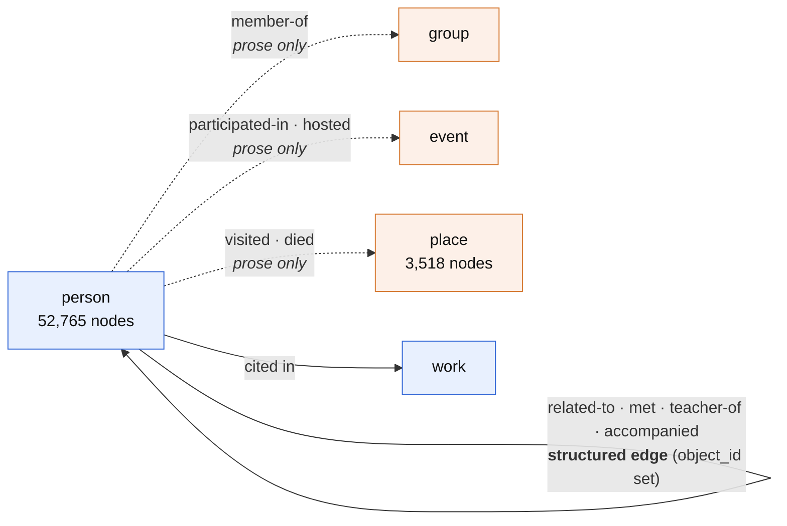

# The person/group/event/place graph — how to query it

## Cheat sheet

1. **Look up the node** — `GET /api/v1/entities/lookup?q=Badasht` (any transliteration; `type=event|place|group|person`).
2. **List the people** — `GET /api/v1/entities/{id}` → `participants[]` for an event/place/group; `GET /api/v1/entities/search?q=` for descriptive queries.
3. **Follow the edges** — filter evidence by `relation`: `participated-in`, `visited`, `hosted`, `died`, `met`, `accompanied`.

**Passage search (`/api/v1/search`, `/search/quick`, `/tools/search`) is for citation — quoting what you found — not for building the list.** It returns paragraphs, not people.

---

## The graph



Solid = a real edge you can join on. Dashed = the link exists only inside the claim's sentence.

## Where the edges actually live

**Every claim hangs off a PERSON.** `entity_claims.entity_id` is the person; the claim carries `relation`,
`statement`, `proof_verbatim`, `doc_id`, `para_id`, and *sometimes* `target_entity_id`.

| link | structured? | measured |
|---|---|---|
| person → person | **yes**, `target_entity_id` set | 392 of 1,508 claims on Quddús (26%) |
| person → event | **no** | 1 of 92 `participated-in` claims on Quddús |
| person → place | **no** | zero claims corpus-wide point `target_entity_id` at a place |

So an event node holds no claims of its own. `GET /api/v1/entities/{id}` on an event therefore assembles
`participants[]` by matching the node's name against claim prose — the same evidence `/entities/search`
returns — and labels that in `participantsProvenance`. **It is recall, not proof:** confirm each with its
`proof` span and `paraId`. `GET /api/v1/entities/capabilities` reports this under `structuredEvent` and
`structuredPlace` so you never have to infer it.

## Worked example — Letters of the Living ∩ `participated-in` Badasht Conference

```bash
# 1. the event node
curl -H "X-API-Key: $KEY" \
  "https://api.siftersearch.com/api/v1/entities/lookup?q=Badasht"
# → { "id": 1264029, "name": "Badasht Conference", "type": "event" }

# 2. its participants, with cited evidence
curl -H "X-API-Key: $KEY" \
  "https://api.siftersearch.com/api/v1/entities/1264029"
# → participants[]: { id, name, relations: ["participated-in"], evidence: [...] }

# 3. the group, to intersect against
curl -H "X-API-Key: $KEY" \
  "https://api.siftersearch.com/api/v1/entities/lookup?q=Letters%20of%20the%20Living"
```

Keep the participants whose `relations` include `participated-in`, then intersect with the Letters of the
Living. `visited`, `hosted` and `died` also answer "who was there" — the relation is yours to filter, and
nothing is dropped on your behalf.

**Verified 2026-08-28** (v2.187.12): Badasht Conference → 9 participants, 8 with `participated-in`;
Letters of the Living → 30; the intersection is **6** — Bahá'u'lláh, the Báb, Quddús, Ṭáhirih,
Mírzá Hádí and Mírzá Muḥammad-‘Alíy-i-Qazvíní, cited to *God Passes By* ¶84/¶88 and
*The Revelation of Bahá'u'lláh* vol. 2.

`participantsProvenance.matchedOn` tells you which word of the node's name a claim had to carry — `badasht`
here. It is the rarest word of the node's PRIMARY name (parenthetical aliases excluded) that still matches
somebody: rare enough that "Second Indian Cultural Conference" cannot ride in on the word *conference*,
never so rare that the list empties.

Only now reach for passage search, to quote what you found:

```bash
curl -X POST -H "X-API-Key: $KEY" -H "Content-Type: application/json" \
  -d '{"query":"Badasht Ṭáhirih unveiled","limit":5}' \
  "https://api.siftersearch.com/api/v1/search"
```

## Fields you will use

| field | on | meaning |
|---|---|---|
| `q` | lookup / search | name in any transliteration, or a description. Stop-words ignored; terms matched independently and ranked, so a missing word lowers rank instead of emptying the result. |
| `relation` | evidence | the edge type — what you filter on |
| `evidence.statement` | evidence | the claim in one line: subject — relation — object |
| `source` / `sourceAbbr` | evidence | book the claim was extracted from |
| `paraId` | evidence | proof paragraph; pass to `GET /api/v1/paragraph/{id}` to quote |

## Identity warning

`id` is `AUTOINCREMENT` and **renumbers on a full rebuild**. Store the `key` (natural key) instead and
re-resolve with `POST /api/v1/entities/resolve`. See `GET /api/v1/entities/capabilities` → `idStability`.
