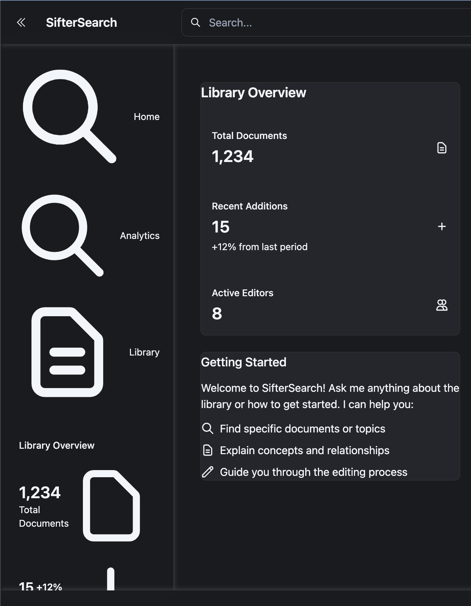

# sv

Everything you need to build a Svelte project, powered by [`sv`](https://github.com/sveltejs/cli).

## Creating a project

If you're seeing this, you've probably already done this step. Congrats!

```bash
# create a new project in the current directory
npx sv create

# create a new project in my-app
npx sv create my-app
```

## Developing

Once you've created a project and installed dependencies with `npm install` (or `pnpm install` or `yarn`), start a development server:

```bash
npm run dev

# or start the server and open the app in a new browser tab
npm run dev -- --open
```

## Building

To create a production version of your app:

```bash
npm run build
```

You can preview the production build with `npm run preview`.

> To deploy your app, you may need to install an [adapter](https://svelte.dev/docs/kit/adapters) for your target environment.

# SifterSearch Admin UI Implementation Checklist

## Phase 1: Basic Structure & Navigation
- [x] Set up SvelteKit project with TailwindCSS
- [x] Implement theme switching (dark/light mode)
- [x] Create base layout components
  - [x] Header
  - [x] Footer
  - [x] Sidebar
  - [x] Navigation
  - [x] Theme Toggle
- [x] Set up initial routes
  - [x] Home page (`/`) with chat interface
  - [x] Documents listing (`/documents`)
  - [x] Document editor (`/edit/[docId]`)
  - [x] Analytics dashboard (`/analytics`)
- [ ] Create remaining routes
  - [ ] Site management (`/sites`)
  - [ ] Library configuration (`/config`)
  - [ ] User management (`/users`)
- [ ] Implement responsive navigation
  - [ ] Mobile menu
  - [ ] Breadcrumbs
  - [ ] Collapsible sidebar

## Phase 2: Authentication & Authorization
- [ ] Set up Clerk authentication
  - [ ] Install and configure Clerk SDK
  - [ ] Create auth hooks
  - [ ] Add sign in/sign up pages
  - [ ] Implement auth guards
- [ ] Implement role-based access
  - [ ] Define role hierarchy (SuperUser > Librarian > Editor > AuthUser > AnonUser)
  - [ ] Create role-based navigation
  - [ ] Add permission checks
  - [ ] Create role management interface

## Phase 3: Document Management
- [ ] Create document listing
  - [ ] Implement filtering
  - [ ] Add sorting
  - [ ] Create metadata editor
  - [ ] Add bulk actions
- [ ] Build document editor
  - [ ] Rich text editing
  - [ ] Version control
  - [ ] Collaborative editing
  - [ ] Auto-save
- [ ] Add document upload
  - [ ] File upload wizard
  - [ ] Batch upload
  - [ ] Progress tracking
  - [ ] Error handling

## Phase 4: Chat Integration
- [ ] Create chat components
  - [ ] Chat interface
  - [ ] Message history
  - [ ] AI responses
  - [ ] Context awareness
- [ ] Implement floating chat button
  - [ ] Position handling
  - [ ] State management
  - [ ] Animations
- [ ] Add AI features
  - [ ] Document suggestions
  - [ ] Content analysis
  - [ ] Metadata generation
  - [ ] Search assistance

## Phase 5: Analytics & Monitoring
- [ ] Build analytics dashboard
  - [ ] Usage statistics
  - [ ] Query metrics
  - [ ] User activity
  - [ ] Document analytics
- [ ] Add real-time updates
  - [ ] WebSocket integration
  - [ ] Live statistics
  - [ ] Activity feed
- [ ] Create monitoring tools
  - [ ] Error tracking
  - [ ] Performance metrics
  - [ ] Usage patterns

## Phase 6: Site Management
- [ ] Create site configuration
  - [ ] Domain management
  - [ ] Crawler rules
  - [ ] Rate limiting
  - [ ] Access control
- [ ] Add backup/restore
  - [ ] Automated backups
  - [ ] Version control
  - [ ] Restore interface
- [ ] Implement deployment tools
  - [ ] Build process
  - [ ] Staging environment
  - [ ] Production deployment

## Phase 7: Testing & Optimization
- [ ] Add comprehensive testing
  - [ ] Unit tests
  - [ ] Integration tests
  - [ ] End-to-end tests
  - [ ] Performance tests
- [ ] Optimize performance
  - [ ] Code splitting
  - [ ] Lazy loading
  - [ ] Caching
  - [ ] Bundle optimization
- [ ] Improve accessibility
  - [ ] ARIA labels
  - [ ] Keyboard navigation
  - [ ] Screen reader support
  - [ ] Color contrast

## Getting Started

1. Install dependencies:
```bash
npm install
```

2. Start development server:
```bash
npm run dev
```

3. Build for production:
```bash
npm run build
```

## Current Status
We are in Phase 1, with basic layout and initial routes implemented. Next steps:
1. Complete remaining routes (`/sites`, `/config`, `/users`)
2. Set up authentication with Clerk
3. Begin implementing document management features
